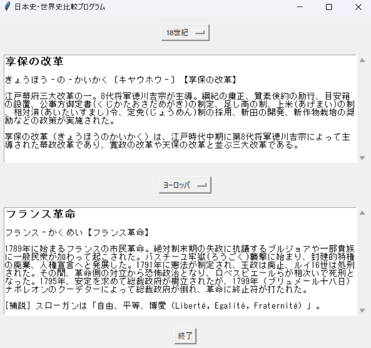

# 日本史・世界史 比較アプリ（Tkinter GUI）

## 概要
このアプリは、Python の Tkinter ライブラリを使って作成された  
日本史と世界史の出来事を比較できるデスクトップ向けGUIアプリです。

日本史・世界史のデータは、Web上の辞書サイトからスクレイピングによって取得された情報を基にしており、  
ユーザーは `japan.csv` と `world.csv` のデータを読み込んで、GUI上で並べて比較することができます。

※ データの取得には `requests` および `BeautifulSoup` を使用しています。  
※ スクレイピング対象は公開されているWeb辞書であり、非営利・学習目的での利用です。

## イメージ画像


## 実行方法

1. Python 3.x がインストールされていることを確認
2. このリポジトリをクローンまたはZIPでダウンロード
3. 以下のコマンドでアプリを起動：

```bash
python main.py